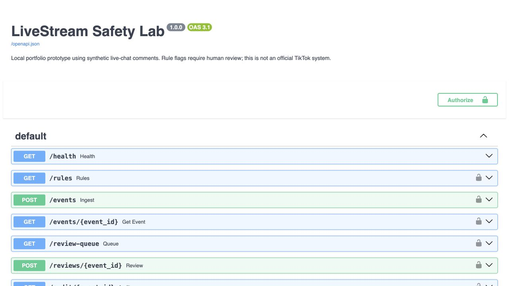

# LiveStream Safety Lab



A small Python backend prototype for **live-chat trust and safety**: explainable rules, a prioritised human-review queue, persistent decisions and audit history. It uses synthetic comments only and is not affiliated with TikTok.

The aim is to explore how safety signals become reviewable decisions—not to claim production-grade moderation or measured improvements in user safety.

## What it demonstrates

- **Rule engine:** configurable suspicious-link, phrase, repeated-message and message-burst rules.
- **Feature extraction:** Unicode normalisation, token n-grams, message fingerprints and room/user-scoped rolling-window counts.
- **Human moderation workflow:** ranked pending queue, allow/remove decisions and contextual review of a deliberately ambiguous quotation.
- **Reliability:** retry-safe event IDs, transactional state changes, concurrent-ingestion tests and protection against double resolution.
- **Risk insights:** counts by rule, pending/completed reviews and time from ingestion to decision.
- **API engineering:** input validation, API-key authentication, parameterised SQL and interactive API documentation.

```text
Synthetic comment -> validated API -> history + rule evaluation
                                          |
                                  SQLite transaction
                                   /             \
                         no rule matched      pending review
                                                   |
                                            human decision
                                                   |
                                         audit log + metrics
```

"Allow" means no configured rule matched, not that content has been proven safe. A review decision is saved locally; it does not remove content from a real platform.

## Quick start

Use Python 3.12 (tested with 3.12.14). No cloud account, API subscription or live-streaming account is needed. Internet access is needed only to install the dependencies and load Swagger's browser assets.

From this repository's root on macOS/Linux:

```bash
python3 -m venv .venv
source .venv/bin/activate
python -m pip install -r requirements.txt
python -m unittest discover -s tests -v
python -m scripts.demo
```

On Windows, create the environment with `py -3.12 -m venv .venv`, activate using `.venv\Scripts\Activate.ps1` in PowerShell, then run the same `python` commands. If activation is restricted, use `.venv\Scripts\python.exe` directly.

The verified demo submits **13 synthetic comments**, flags **5**, records **2 human decisions**, and leaves **3 pending reviews**. One reviewer clears an educational quotation, illustrating why a phrase match is not a final judgement. Output: `build/demo_report.json`. The demo uses a temporary database and a simulated clock; its 25.5-second time-to-decision value is **not a measured reviewer productivity result**.

The pinned Starlette/httpx combination currently emits a deprecation warning when importing TestClient. It does not prevent the tests or demo from passing; an eventual test-client dependency migration should be verified before updating the pins.

## Explore the API

```bash
python -m uvicorn safety_lab.api:create_app --factory --host 127.0.0.1 --port 8000
```

Open **http://127.0.0.1:8000/docs**. Click **Authorize**, enter `local-demo-key`, then use **Try it out** on the endpoints. The API key is a public development default, not a secret. Keep this demo bound to localhost. A custom key can be supplied through `SAFETY_API_KEY`; do not commit real keys.

For `POST /events`, use:

```json
{
  "event_id": "example-1",
  "room_id": "demo-room",
  "user_id": "viewer-1",
  "text": "Claim a bonus at https://rewards.example/claim"
}
```

Then inspect `GET /review-queue`. For `POST /reviews/{event_id}`, set `event_id` to `example-1` and use:

```json
{
  "decision": "remove",
  "reviewer": "demo-reviewer",
  "note": "Synthetic watchlist-link example"
}
```

Inspect `GET /audit/example-1` and `GET /metrics`. Re-submit the original event unchanged: the API returns its existing record without counting it twice. Change the text but reuse its ID: it returns a conflict. Re-review a resolved item: it also returns a conflict.

The API database persists at `data/safety.db`, unlike the temporary demo database. Set `SAFETY_DB` to a different path to use another database. Stop the server with Ctrl+C.

| Endpoint | Purpose |
| --- | --- |
| `GET /health` | Public database-connectivity check |
| `GET /rules` | Active configuration and fingerprinted version |
| `POST /events` | Ingest/classify a comment; 201 new, 200 identical retry, 409 conflicting ID |
| `GET /events/{event_id}` | Retrieve stored state |
| `GET /review-queue?limit=20&offset=0` | Pending events ranked by priority, then oldest first |
| `POST /reviews/{event_id}` | Record a single allow/remove decision |
| `GET /audit/{event_id}` | Classification and human-decision history |
| `GET /metrics` | Counts, rule signals and average time to decision |

All endpoints except health and API documentation require `X-API-Key`. Invalid input returns 422, unknown records 404, and missing/incorrect credentials 401. A database lock timeout returns 503 with `Retry-After: 1`; retry using the **same event ID and payload**.

## Rules and data structures

Edit `config/rules.json`, then restart the application. Each saved event includes the configuration version and a content hash, so the decision can be associated with the configuration that produced it. Changing rules does not reclassify previous events.

| Signal | Demo condition | Queue priority |
| --- | --- | --- |
| Suspicious link | HTTP(S) link to `rewards.example` or its subdomain | 90 |
| Harassment phrase | A configured token phrase appears, including inside quotations | 80 |
| Repeated message | Third or later matching normalised message by the same user in the same room within 60 seconds | 60 |
| Burst activity | Sixth or later message by that user in that room within 60 seconds | 40 |

Multiple matches retain all reasons and use the **maximum priority**, not a harm probability. The history window is `(now - 60, now]`, using server ingestion time. Identical retries do not increase the counters. Case folding and whitespace normalisation make common repetition variants match; the original text is retained for review.

- Token tuples and n-gram sets support whole-token phrase checks. For a fixed maximum phrase length, building n-grams scales linearly with the comment's token count per distinct phrase length.
- SHA-256 fingerprints support normalised-message comparison; they are not anonymisation, since raw comments are stored too.
- A composite index scopes history by room, user and time. Counting scans the matching window records, so very active users still cost more.
- An ordered database index supports a **persistent** priority queue instead of an in-memory heap. Large offset pagination can get slower; cursor pagination is a future improvement.
- `Counter` aggregates matched signals. One event may contribute to multiple signal counts.

## Reliability choices

Ingestion uses one `BEGIN IMMEDIATE` transaction for duplicate checking, history calculation, classification, event insertion and audit insertion. This prevents concurrent arrivals from observing the same incomplete history. Review resolution uses the same approach: the first valid decision wins and a later competing decision receives a conflict.

SQLite WAL allows readers to coexist with a writer, but there is still **only one writer at a time**. The design intentionally favours a clear, durable local prototype over distributed scale. Each operation uses its own connection; SQLite waits up to 10 seconds for locks. The audit is application-maintained, not tamper-proof against someone with database access.

## Verification and local experiment

```bash
python -m unittest discover -s tests -v
python -m scripts.demo
python -m scripts.benchmark --events 500 --workers 8
```

**34 tests passed** on Python 3.12.14 during preparation. They cover rules, normalisation, time-window boundaries, room/user isolation, retry semantics, persistence, queue order, API validation/authentication, audit entries, concurrent writes and competing reviewers. See `tests/test_safety_lab.py`.

A separate localhost smoke check also passed against a real Uvicorn process: startup, documentation, authentication, ingestion, retry, queue retrieval, review conflict, audit and metrics. This checks the server path, not production deployment readiness.

`examples/demo_report.json` and `examples/benchmark_sample.json` preserve one verified run. The benchmark submits 500 events through 8 worker threads directly to the storage service. It verifies event totals and expected flags and reports local latency/throughput. It **excludes HTTP, network, server scheduling and real traffic**. It does not establish high-concurrency production capacity, a service-level objective or moderation accuracy. Re-run it on your own machine; performance varies.

The GitHub Actions workflow is configured to run tests and the demo on Python 3.11–3.13. Only the local Python 3.12 run has been verified here; remote CI results will be available after publishing.

## Limitations and responsible use

- No TikTok integration, audio/video analysis, machine-learning classifier, semantic understanding or multilingual validation.
- Small English phrase lists create false positives and miss paraphrases, obfuscation and context. The demo is not a safety-efficacy evaluation.
- Shared API key only: no roles, verified reviewer identity, tenant isolation, login or rate limiting. `reviewer` is caller-supplied text.
- No queue assignment/leases, appeals, rule-management UI or automatic enforcement. Simultaneous reviewers can read the same item; conflicting resolution is rejected.
- No request-body cap at a reverse proxy, TLS deployment, retention policy, PII redaction, backups or tamper-evident audit system. Use synthetic data only and do not expose this demo publicly as-is.
- Wall-clock changes can affect time-window counts and decision-time metrics. `average_time_to_decision_seconds` includes queue wait; it is not reviewer handling time.
- All historical events are retained and metrics scan history. SQLite's single writer and offset pagination limit scaling.

Possible next steps: evaluate precision/recall on a labelled synthetic dataset; add reviewer roles and leases; introduce retention; benchmark the HTTP API; then consider PostgreSQL plus partitioned event processing if observed load justifies it. A future distributed design must preserve room/user ordering and retry semantics rather than merely adding workers.

## Publish on GitHub

1. Extract the project ZIP and open this folder. Run the tests and demo first.
2. Create an empty repository named `livestream-safety-lab` in your account.
3. Upload this folder's **contents**, including `.github/workflows/tests.yml` and `.gitignore` (hidden folders may need to be enabled). Do not upload `.venv`, `build`, `data`, secrets, or your résumé.
4. Check the Actions tab after publishing. Add the repository link to your résumé only once it exists.

Suggested description: **Python trust-and-safety prototype with configurable chat rules, a prioritised human-review queue, SQLite audit history and concurrency tests.**

See [Interview guide](docs/INTERVIEW_GUIDE.md) for a code walkthrough and exercises. No licence is included: choose one yourself before granting reuse permissions.

## Technical references

- [FastAPI testing documentation](https://fastapi.tiangolo.com/tutorial/testing/)
- [Python sqlite3 documentation](https://docs.python.org/3.13/library/sqlite3.html)
- [SQLite WAL design and concurrency limits](https://www.sqlite.org/wal.html)
- [SQLite transaction isolation](https://www.sqlite.org/isolation.html)

## Publication verification — 25 September 2026

All 34 tests and the synthetic demo passed on Python 3.12. The real HTTP smoke check passed; reproduce with `python -m scripts.smoke_http`. API screenshot captured locally.

See [two-minute demo walkthrough](docs/DEMO.md).
